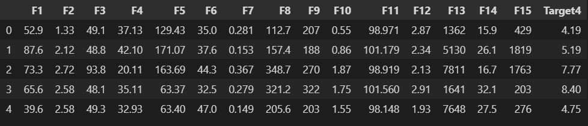
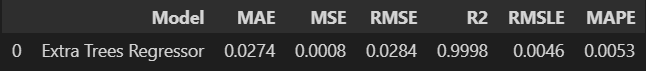

<!DOCTYPE html>
<body>
    <h1>Fuel Cell Performance Predictor Using Pycaret</h1>
    

    <h2>Table of Contents</h2>
    <ol>
        <li><a href="#introduction">Introduction</a></li>
        <li><a href="#technologies-used">Technologies Used</a></li>
        <li><a href="#dataset">Dataset</a></li>
        <li><a href="#setup">Setup Using Pycaret</a></li>
        <li><a href="#model">Model Comparison</a></li>        
        <li><a href="#results">Result Analysis</a></li>
    </ol>
    <h2 id="introduction">Introduction</h2>
    

        This project aims to predict fuel cell performance metrics using <strong>PyCaret</strong>, a Python-based automated machine learning library. 
        PyCaret simplifies the process of building, tuning, and evaluating multiple regression models, enabling faster insights and decision-making.
    

    <h2 id="technologies-used">Technologies Used</h2>
    <ul>
        <li><strong>Programming Language:</strong> Python</li>
        <li><strong>Libraries:</strong>
            <ul>
                <li><code>PyCaret</code> for machine learning</li>
                <li><code>Pandas</code> for data manipulation</li>
            </ul>
        </li>
        <li><strong>Development Environment:</strong> Jupyter Notebook</li>
    </ul>
    <h2 id="dataset">Dataset</h2>
    

        The dataset used contains fuel cell performance data:
    

    <ul>
       
    </ul>
    <h2 id="setup">Setup Using Pycaret</h2>
    <ol>
<table id="T_b8853">
  <thead>
    <tr>
      <th class="blank level0" >&nbsp;</th>
      <th id="T_b8853_level0_col0" class="col_heading level0 col0" >Description</th>
      <th id="T_b8853_level0_col1" class="col_heading level0 col1" >Value</th>
    </tr>
  </thead>
  <tbody>
    <tr>
      <th id="T_b8853_level0_row0" class="row_heading level0 row0" >0</th>
      <td id="T_b8853_row0_col0" class="data row0 col0" >Session id</td>
      <td id="T_b8853_row0_col1" class="data row0 col1" >1</td>
    </tr>
    <tr>
      <th id="T_b8853_level0_row1" class="row_heading level0 row1" >1</th>
      <td id="T_b8853_row1_col0" class="data row1 col0" >Target</td>
      <td id="T_b8853_row1_col1" class="data row1 col1" >Target4_y</td>
    </tr>
    <tr>
      <th id="T_b8853_level0_row2" class="row_heading level0 row2" >2</th>
      <td id="T_b8853_row2_col0" class="data row2 col0" >Target type</td>
      <td id="T_b8853_row2_col1" class="data row2 col1" >Regression</td>
    </tr>
    <tr>
      <th id="T_b8853_level0_row3" class="row_heading level0 row3" >3</th>
      <td id="T_b8853_row3_col0" class="data row3 col0" >Original data shape</td>
      <td id="T_b8853_row3_col1" class="data row3 col1" >(1000, 17)</td>
    </tr>
    <tr>
      <th id="T_b8853_level0_row4" class="row_heading level0 row4" >4</th>
      <td id="T_b8853_row4_col0" class="data row4 col0" >Transformed data shape</td>
      <td id="T_b8853_row4_col1" class="data row4 col1" >(1000, 17)</td>
    </tr>
    <tr>
      <th id="T_b8853_level0_row5" class="row_heading level0 row5" >5</th>
      <td id="T_b8853_row5_col0" class="data row5 col0" >Transformed train set shape</td>
      <td id="T_b8853_row5_col1" class="data row5 col1" >(700, 17)</td>
    </tr>
    <tr>
      <th id="T_b8853_level0_row6" class="row_heading level0 row6" >6</th>
      <td id="T_b8853_row6_col0" class="data row6 col0" >Transformed test set shape</td>
      <td id="T_b8853_row6_col1" class="data row6 col1" >(300, 17)</td>
    </tr>
    <tr>
      <th id="T_b8853_level0_row7" class="row_heading level0 row7" >7</th>
      <td id="T_b8853_row7_col0" class="data row7 col0" >Numeric features</td>
      <td id="T_b8853_row7_col1" class="data row7 col1" >16</td>
    </tr>
    <tr>
      <th id="T_b8853_level0_row8" class="row_heading level0 row8" >8</th>
      <td id="T_b8853_row8_col0" class="data row8 col0" >Preprocess</td>
      <td id="T_b8853_row8_col1" class="data row8 col1" >True</td>
    </tr>
    <tr>
      <th id="T_b8853_level0_row9" class="row_heading level0 row9" >9</th>
      <td id="T_b8853_row9_col0" class="data row9 col0" >Imputation type</td>
      <td id="T_b8853_row9_col1" class="data row9 col1" >simple</td>
    </tr>
    <tr>
      <th id="T_b8853_level0_row10" class="row_heading level0 row10" >10</th>
      <td id="T_b8853_row10_col0" class="data row10 col0" >Numeric imputation</td>
      <td id="T_b8853_row10_col1" class="data row10 col1" >mean</td>
    </tr>
    <tr>
      <th id="T_b8853_level0_row11" class="row_heading level0 row11" >11</th>
      <td id="T_b8853_row11_col0" class="data row11 col0" >Categorical imputation</td>
      <td id="T_b8853_row11_col1" class="data row11 col1" >mode</td>
    </tr>
    <tr>
      <th id="T_b8853_level0_row12" class="row_heading level0 row12" >12</th>
      <td id="T_b8853_row12_col0" class="data row12 col0" >Transformation</td>
      <td id="T_b8853_row12_col1" class="data row12 col1" >True</td>
    </tr>
    <tr>
      <th id="T_b8853_level0_row13" class="row_heading level0 row13" >13</th>
      <td id="T_b8853_row13_col0" class="data row13 col0" >Transformation method</td>
      <td id="T_b8853_row13_col1" class="data row13 col1" >yeo-johnson</td>
    </tr>
    <tr>
      <th id="T_b8853_level0_row14" class="row_heading level0 row14" >14</th>
      <td id="T_b8853_row14_col0" class="data row14 col0" >Normalize</td>
      <td id="T_b8853_row14_col1" class="data row14 col1" >True</td>
    </tr>
    <tr>
      <th id="T_b8853_level0_row15" class="row_heading level0 row15" >15</th>
      <td id="T_b8853_row15_col0" class="data row15 col0" >Normalize method</td>
      <td id="T_b8853_row15_col1" class="data row15 col1" >zscore</td>
    </tr>
    <tr>
      <th id="T_b8853_level0_row16" class="row_heading level0 row16" >16</th>
      <td id="T_b8853_row16_col0" class="data row16 col0" >Fold Generator</td>
      <td id="T_b8853_row16_col1" class="data row16 col1" >KFold</td>
    </tr>
    <tr>
      <th id="T_b8853_level0_row17" class="row_heading level0 row17" >17</th>
      <td id="T_b8853_row17_col0" class="data row17 col0" >Fold Number</td>
      <td id="T_b8853_row17_col1" class="data row17 col1" >10</td>
    </tr>
    <tr>
      <th id="T_b8853_level0_row18" class="row_heading level0 row18" >18</th>
      <td id="T_b8853_row18_col0" class="data row18 col0" >CPU Jobs</td>
      <td id="T_b8853_row18_col1" class="data row18 col1" >-1</td>
    </tr>
    <tr>
      <th id="T_b8853_level0_row19" class="row_heading level0 row19" >19</th>
      <td id="T_b8853_row19_col0" class="data row19 col0" >Use GPU</td>
      <td id="T_b8853_row19_col1" class="data row19 col1" >False</td>
    </tr>
    <tr>
      <th id="T_b8853_level0_row20" class="row_heading level0 row20" >20</th>
      <td id="T_b8853_row20_col0" class="data row20 col0" >Log Experiment</td>
      <td id="T_b8853_row20_col1" class="data row20 col1" >False</td>
    </tr>
    <tr>
      <th id="T_b8853_level0_row21" class="row_heading level0 row21" >21</th>
      <td id="T_b8853_row21_col0" class="data row21 col0" >Experiment Name</td>
      <td id="T_b8853_row21_col1" class="data row21 col1" >reg-default-name</td>
    </tr>
    <tr>
      <th id="T_b8853_level0_row22" class="row_heading level0 row22" >22</th>
      <td id="T_b8853_row22_col0" class="data row22 col0" >USI</td>
      <td id="T_b8853_row22_col1" class="data row22 col1" >52ac</td>
    </tr>
  </tbody>
</table>
    </ol>
 <h2 id="model">Model Comparison</h2>
    

        Top 5 Regression Models for our Dataset using Pycaret: 
    

    <ol>
<table id="T_7ef44">
  <thead>
    <tr>
      <th class="blank level0" >&nbsp;</th>
      <th id="T_7ef44_level0_col0" class="col_heading level0 col0" >Model</th>
      <th id="T_7ef44_level0_col1" class="col_heading level0 col1" >MAE</th>
      <th id="T_7ef44_level0_col2" class="col_heading level0 col2" >MSE</th>
      <th id="T_7ef44_level0_col3" class="col_heading level0 col3" >RMSE</th>
      <th id="T_7ef44_level0_col4" class="col_heading level0 col4" >R2</th>
      <th id="T_7ef44_level0_col5" class="col_heading level0 col5" >RMSLE</th>
      <th id="T_7ef44_level0_col6" class="col_heading level0 col6" >MAPE</th>
      <th id="T_7ef44_level0_col7" class="col_heading level0 col7" >TT (Sec)</th>
    </tr>
  </thead>
  <tbody>
    <tr>
      <th id="T_7ef44_level0_row0" class="row_heading level0 row0" >et</th>
      <td id="T_7ef44_row0_col0" class="data row0 col0" >Extra Trees Regressor</td>
      <td id="T_7ef44_row0_col1" class="data row0 col1" >0.0053</td>
      <td id="T_7ef44_row0_col2" class="data row0 col2" >0.0001</td>
      <td id="T_7ef44_row0_col3" class="data row0 col3" >0.0090</td>
      <td id="T_7ef44_row0_col4" class="data row0 col4" >1.0000</td>
      <td id="T_7ef44_row0_col5" class="data row0 col5" >0.0014</td>
      <td id="T_7ef44_row0_col6" class="data row0 col6" >0.0011</td>
      <td id="T_7ef44_row0_col7" class="data row0 col7" >0.2910</td>
    </tr>
    <tr>
      <th id="T_7ef44_level0_row1" class="row_heading level0 row1" >rf</th>
      <td id="T_7ef44_row1_col0" class="data row1 col0" >Random Forest Regressor</td>
      <td id="T_7ef44_row1_col1" class="data row1 col1" >0.0114</td>
      <td id="T_7ef44_row1_col2" class="data row1 col2" >0.0004</td>
      <td id="T_7ef44_row1_col3" class="data row1 col3" >0.0183</td>
      <td id="T_7ef44_row1_col4" class="data row1 col4" >0.9999</td>
      <td id="T_7ef44_row1_col5" class="data row1 col5" >0.0029</td>
      <td id="T_7ef44_row1_col6" class="data row1 col6" >0.0023</td>
      <td id="T_7ef44_row1_col7" class="data row1 col7" >0.3630</td>
    </tr>
    <tr>
      <th id="T_7ef44_level0_row2" class="row_heading level0 row2" >gbr</th>
      <td id="T_7ef44_row2_col0" class="data row2 col0" >Gradient Boosting Regressor</td>
      <td id="T_7ef44_row2_col1" class="data row2 col1" >0.0160</td>
      <td id="T_7ef44_row2_col2" class="data row2 col2" >0.0005</td>
      <td id="T_7ef44_row2_col3" class="data row2 col3" >0.0217</td>
      <td id="T_7ef44_row2_col4" class="data row2 col4" >0.9999</td>
      <td id="T_7ef44_row2_col5" class="data row2 col5" >0.0035</td>
      <td id="T_7ef44_row2_col6" class="data row2 col6" >0.0032</td>
      <td id="T_7ef44_row2_col7" class="data row2 col7" >0.2210</td>
    </tr>
    <tr>
      <th id="T_7ef44_level0_row3" class="row_heading level0 row3" >dt</th>
      <td id="T_7ef44_row3_col0" class="data row3 col0" >Decision Tree Regressor</td>
      <td id="T_7ef44_row3_col1" class="data row3 col1" >0.0225</td>
      <td id="T_7ef44_row3_col2" class="data row3 col2" >0.0012</td>
      <td id="T_7ef44_row3_col3" class="data row3 col3" >0.0333</td>
      <td id="T_7ef44_row3_col4" class="data row3 col4" >0.9998</td>
      <td id="T_7ef44_row3_col5" class="data row3 col5" >0.0052</td>
      <td id="T_7ef44_row3_col6" class="data row3 col6" >0.0044</td>
      <td id="T_7ef44_row3_col7" class="data row3 col7" >0.0490</td>
    </tr>
    <tr>
      <th id="T_7ef44_level0_row4" class="row_heading level0 row4" >lightgbm</th>
      <td id="T_7ef44_row4_col0" class="data row4 col0" >Light Gradient Boosting Machine</td>
      <td id="T_7ef44_row4_col1" class="data row4 col1" >0.0212</td>
      <td id="T_7ef44_row4_col2" class="data row4 col2" >0.0016</td>
      <td id="T_7ef44_row4_col3" class="data row4 col3" >0.0372</td>
      <td id="T_7ef44_row4_col4" class="data row4 col4" >0.9997</td>
      <td id="T_7ef44_row4_col5" class="data row4 col5" >0.0068</td>
      <td id="T_7ef44_row4_col6" class="data row4 col6" >0.0047</td>
      <td id="T_7ef44_row4_col7" class="data row4 col7" >0.2110</td>
    </tr>
  </tbody>
</table>
    </ol>
    <h2 id="results">Result Analysis</h2>
    
The <strong>best-performing model</strong> identified was <code>Extra Trees Regressor</code> with the following metrics on Testing Data:

    <ul>
    
    </ul>
</body>
</html>

 
